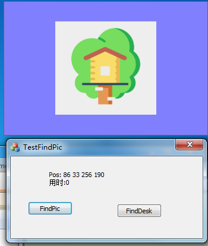
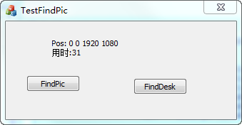

#### 前提

以前用过大漠插件通过查图写过简单的外挂，对原理还挺好奇的。
今天在帖子附件中看到一段查图算法，提取出来，做了个demo。

https://bbs.pediy.com/thread-197474.htm

#### 测试查找效率

- 查找小房子

<p align="left">

</p>

- 查找整个桌面

<p align="left">

</p>


#### 效率问题

resemble: 相似度，相同像素占总像素的比例,默认值为0.9

相似度越大查找效率越快

#### 查图算法

```cpp
BOOL FindPic(const Cbm & bmWnd, const Cbm & bmFile, LPCRECT rectTarget, OUT PRECT retRect, int resemble, COLORREF rgb)
{
    if (!(bmFile.pBits && bmWnd.pBits) || bmFile.cxDib > bmWnd.cxDib || bmFile.cyDib > bmWnd.cyDib)
        return FALSE;

    resemble = max(resemble, 0);
    resemble = min(resemble, 100);

    BYTE r = GetRValue(rgb);
    BYTE g = GetGValue(rgb);
    BYTE b = GetBValue(rgb);


    // 实际范围
    RECT rectDefault;
    if (rectTarget && bmWnd.IsInRect(*rectTarget))
        rectDefault = *rectTarget;
    else
        bmWnd.GetBitmapRect(rectDefault);

    // bmFile图像坐标(x, y),  bmWnd图像坐标(x + xOffset, y + yOffset)
    int yTotal        =    rectDefault.bottom - bmFile.cyDib;
    int xTotal        =    rectDefault.right - bmFile.cxDib;
    int invalidTotal  =    (100 - resemble) * (bmFile.cxDib * bmFile.cyDib);
    int validTotal    =    resemble * (bmFile.cxDib * bmFile.cyDib);


    //  ignoreNum忽略值, validNum有效值，invalidNum无效值
    int invalidNum = 0, validNum = 0,  ignoreNum = 0;
    for (int yOffset = rectDefault.top; yOffset <= yTotal; yOffset++)
        for (int xOffset = rectDefault.left; xOffset <= xTotal; xOffset++)
        {
            for (int y = 0, bflag = TRUE; bflag && (y < bmFile.cyDib); y++)
                for (int x = 0; x < bmFile.cxDib; x++)
                {
                    int FileIndex = (bmFile.cyDib - 1 - y) * bmFile.cBits + 3 * x;
                    int WndIndex  = (bmWnd.cyDib - 1 - yOffset - y) * bmWnd.cBits + 3 * (xOffset + x);


                    if (r    == bmFile.pBits[FileIndex + 2] &&
                        g    == bmFile.pBits[FileIndex + 1] &&
                        b    == bmFile.pBits[FileIndex]     &&
                        0xF8 != bmWnd.pBits[WndIndex + 2]   &&
                        0xFC != bmWnd.pBits[WndIndex + 1]   &&
                        0xF8 != bmWnd.pBits[WndIndex]) {

                            ignoreNum++;
                    }		
                    else if (bmFile.pBits[FileIndex + 2] == bmWnd.pBits[WndIndex + 2] &&
                        bmFile.pBits[FileIndex + 1] == bmWnd.pBits[WndIndex + 1] &&
                        bmFile.pBits[FileIndex] == bmWnd.pBits[WndIndex]) {

                            validNum++;
                    }
                    else
                        invalidNum++;


                    if (100 * invalidNum > invalidTotal)
                    {
                        invalidNum = validNum = ignoreNum = 0;
                        bflag = FALSE;
                        break;
                    }

                    if (100 * (validNum + ignoreNum) >= validTotal)
                    {
                        if (retRect)
                        {
                            retRect->left   = xOffset;
                            retRect->top    = yOffset;
                            retRect->right  = xOffset + bmFile.cxDib;
                            retRect->bottom = yOffset + bmFile.cyDib;
                        }
                        return TRUE;
                    }
                }
        }
        return FALSE;
}
```

